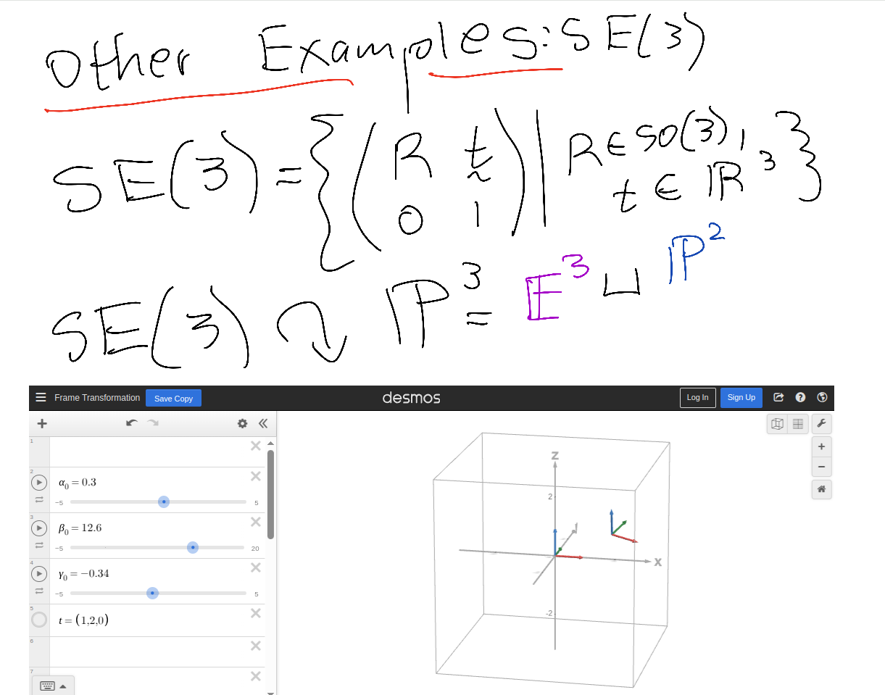

# Lie Theory for Control and Estimation Talk Slides

This repository will run the interactive and dynamic talk titled "Lie Theory for Control and Estimation" produced by Sepehr Saryazdi.

This talk was prepared with the following main sources:

https://arxiv.org/pdf/1812.01537

https://core.ac.uk/download/pdf/82428733.pdf

https://scholar.rose-hulman.edu/cgi/viewcontent.cgi?article=1047&context=rhumj

https://ethaneade.com/lie.pdf

https://citeseerx.ist.psu.edu/document?repid=rep1&type=pdf&doi=b212fe3c963e72f1573ba1476ad398183fa92189

https://proceedings.mlr.press/v97/lezcano-casado19a/lezcano-casado19a-supp.pdf

https://www.cse.lehigh.edu/~trink/Courses/RoboticsII/reading/murray-li-sastry-94-complete.pdf

https://www.cis.upenn.edu/~cis6100/geombchap14.pdf


To run backend server, run the following from this folder:

```
python3 localServer/server.py
```

Open `index.html` for the slides. This is what should appear on the HTML page. Use left/right arrow keys to navigate between slides.

<p align="center">

</p>


If the HTML page is working correctly, interactive components should appear:


<p align="center">

</p>


